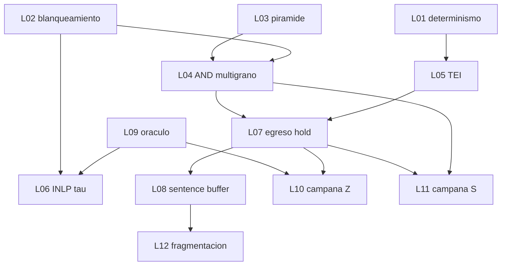

# Pilares — trabajo tomable (PDF condensado)

> Pack de implementación. Una IA = un ticket. Fuente: el documento de 4 pilares (blanqueamiento + INLP, ingesta fractal, TEI, rompepepe bidireccional, egreso dual-profile).
>
> **No es Nivel 1.** El filtro de producción no se cambia hasta que el ticket lo pida (laboratorio / tabla aparte / feature flag).
>
> Análisis histórico (no se ejecuta): [`../archivo/README.md`](../archivo/README.md).

## Dirección de producto (2026-09-17)

El objetivo no es “tres cabezas”. Es un **firewall semántico determinista que funciona** en un deployment.

El pipeline de producción (Noise / Cosine / Excitation) **no se reescribe** hasta que un ticket lo liste. L01–L02 son instrumento + nueva base (z-score), todavía en laboratorio.

Experimento diferido (otra etapa, no mezclar en L03–L06):

1. **Cosine-only** — baseline: solo diferencia de coseno.
2. **Filtro nuevo** — geometría blanqueada (y lo que L04/L06 agreguen) sobre el mismo dataset y el mismo fingerprint de embedder.

Hasta ese A/B, no se “salva” la excitación cruda ni se la vende como titular.

---

## Cómo tomar un ticket

1. Leé [`00-alcance.md`](./00-alcance.md) y la spec del pilar que toca el ticket.
2. En la tabla de abajo, reclamá **un** ticket en `pendiente` → `en_curso` (una IA, un archivo).
3. Seguí el ticket al pie: TDD, `uv run`, DoD. Plantilla: [`00-plantilla-ticket.md`](./00-plantilla-ticket.md).
4. Al cerrar: marcá `hecho`, actualizá esta tabla. Doc-sync de `CONTEXT.md` / spec / README de producto **solo** si el ticket lo pide.

No implementes nada que no esté en L01–L12. Si parece “útil” y no está acá, es otra etapa.

---

## Estado

| ID | Ticket | Ola | Estado | Depende de | Paralelo con |
| :--- | :--- | :---: | :--- | :--- | :--- |
| L01 | [Determinismo embedder actual](./tickets/L01-determinismo-embedder-actual.md) | 1 | hecho | — | L02, L03, L09 |
| L02 | [Blanqueamiento offline](./tickets/L02-blanqueamiento-offline.md) | 1 | hecho | — | L01, L03, L09 |
| L03 | [Ingesta pirámide laboratorio](./tickets/L03-ingesta-piramide-laboratorio.md) | 1 | hecho | — | L01, L02, L09 |
| L04 | [AND multi-grano offline](./tickets/L04-and-multigrano-offline.md) | 1 | hecho | L02, L03 | — |
| L05 | [Sidecar TEI](./tickets/L05-sidecar-tei.md) | 2 | hecho | L01 | L04, L06, L09 |
| L06 | [INLP y τ](./tickets/L06-inlp-y-tau.md) | 3 | hecho | L02, L09 | L05, L07 |
| L07 | [Egreso compliance hold](./tickets/L07-egreso-compliance-hold.md) | 3 | hecho | L04, L05 | L06, L09 |
| L08 | [Egreso chat sentence buffer](./tickets/L08-egreso-chat-sentence-buffer.md) | 3 | hecho | L07 | — |
| L09 | [Oracle y métricas](./tickets/L09-oraculo-y-metricas.md) | 4 | hecho | — | L01, L02, L03 |
| L10 | [Campaña Z exfil](./tickets/L10-campana-Z-exfil.md) | 4 | hecho | L07, L09 | L11 |
| L11 | [Campaña S desvío](./tickets/L11-campana-S-desvio.md) | 4 | pendiente | L04, L07, L09 | L10 |
| L12 | [Campaña fragmentación](./tickets/L12-campana-fragmentacion.md) | 4 | pendiente | L08, L09 | — |

Estados: `pendiente` | `en_curso` | `hecho`.

---

## Specs

| Spec | Pilar del PDF |
| :--- | :--- |
| [`specs/pilar-1-geometria.md`](./specs/pilar-1-geometria.md) | Blanqueamiento + subespacio ortogonal INLP y τ |
| [`specs/pilar-2-ingesta-fractal.md`](./specs/pilar-2-ingesta-fractal.md) | Pirámide 4 granos, schema LanceDB, AND multi-grano |
| [`specs/pilar-3-tei-determinismo.md`](./specs/pilar-3-tei-determinismo.md) | Floats no deterministas → sidecar TEI pinneado |
| [`specs/pilar-4-rompepepe.md`](./specs/pilar-4-rompepepe.md) | 3 campañas, Explorer + Oracle, métricas de brecha |
| [`specs/pilar-egreso-dual-profile.md`](./specs/pilar-egreso-dual-profile.md) | Sentence buffering (Chat) + full hold (Compliance/CDE) |

---

## Dependencias

Arranque paralelo seguro: **L01, L02, L03, L09**.

---

## Aislamiento

Olas 1–2 (salvo el corte final de L05) viven en scripts/tablas de laboratorio. No migrar la tabla `knowledge` ni reescribir `evaluate_clause()` hasta que el ticket lo liste en “Archivos a tocar”.
