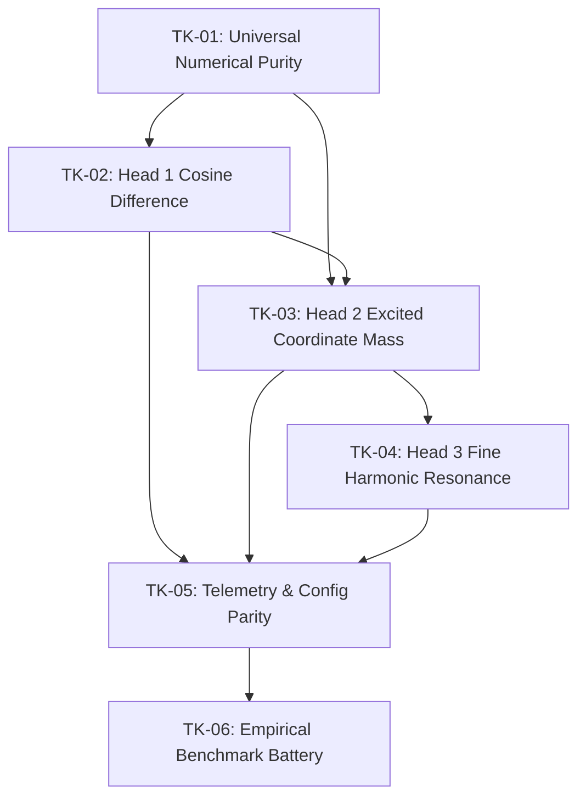

# Engineering Tickets Index — Three-Headed Semantic Firewall

This directory houses the six canonical implementation tickets designed to be autonomously executed by AI coding agents.

---

## Execution Order & Dependency Graph

---

## Summary of Tickets

| Ticket | Summary | Files to Touch |
| :--- | :--- | :--- |
| **[TK-01](./TK01-numerical-purity-enforcement.md)** | Eradicate all `round()`, lossy float formatting, and float16 casts. Enforce IEEE 754 full mantissa (`%.17g`). | `backend/app/core/firewall.py`, `models.py`, `storage.py`, `corpus_calibration.py` |
| **[TK-02](./TK02-head1-cosine-difference-gate.md)** | Establish Cosine Difference ($1 - \cos$) as Head 1 with configurable threshold $\tau_{\cos}$ and fast short-circuit. | `backend/app/core/firewall.py`, `models.py` |
| **[TK-03](./TK03-head2-excited-dimensions-counter.md)** | Implement Head 2 coordinate activation mass counter ($N_{act} \ge \tau_{coarse}$) with unrounded delta. | `backend/app/core/firewall.py`, `models.py` |
| **[TK-04](./TK04-head3-fine-harmonic-resonance.md)** | Replace the legacy noise filter with the 17-digit Fine Harmonic Resonance Gate ($solo\_b == 0 \land solo\_a \ge \tau_{\text{floor}}$). | `backend/app/core/firewall.py`, `storage.py`, `models.py` |
| **[TK-05](./TK05-config-state-and-telemetry-parity.md)** | Update `ConfigState`, sniffer SSE streaming, and `/chat` inline ASCII telemetry for all three heads. | `models.py`, `sniffer.py`, `chat.py`, `state.py` |
| **[TK-06](./TK06-empirical-benchmark-validation.md)** | Execute the 215-prompt benchmark battery (Prisma ES + AdvBench) and demonstrate Youden $J > 0.95$ without false positives. | `backend/tests/benchmark_suite.py` |
